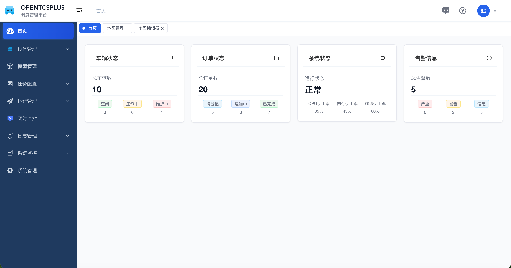
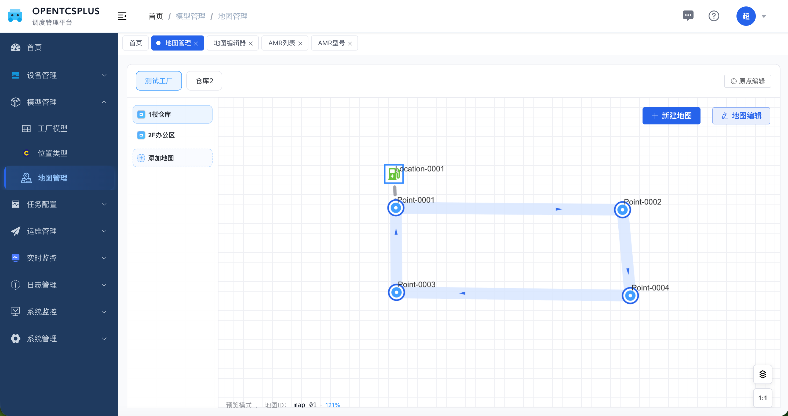
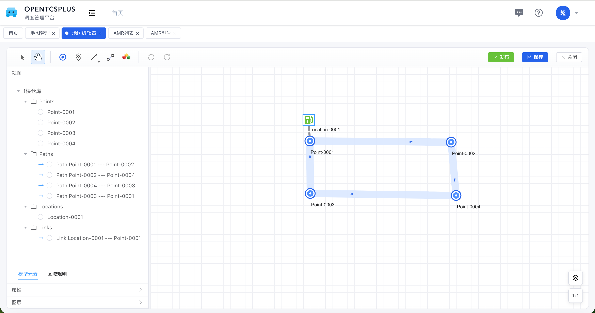
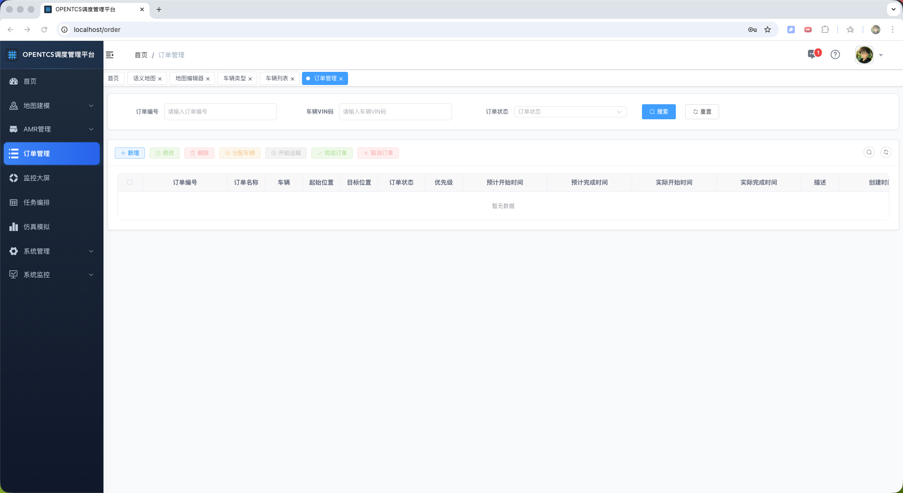
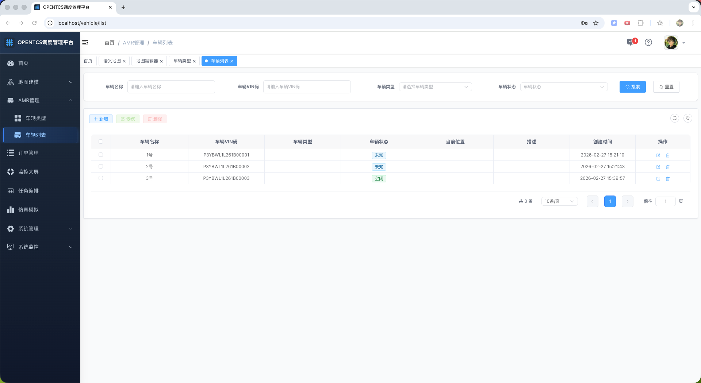
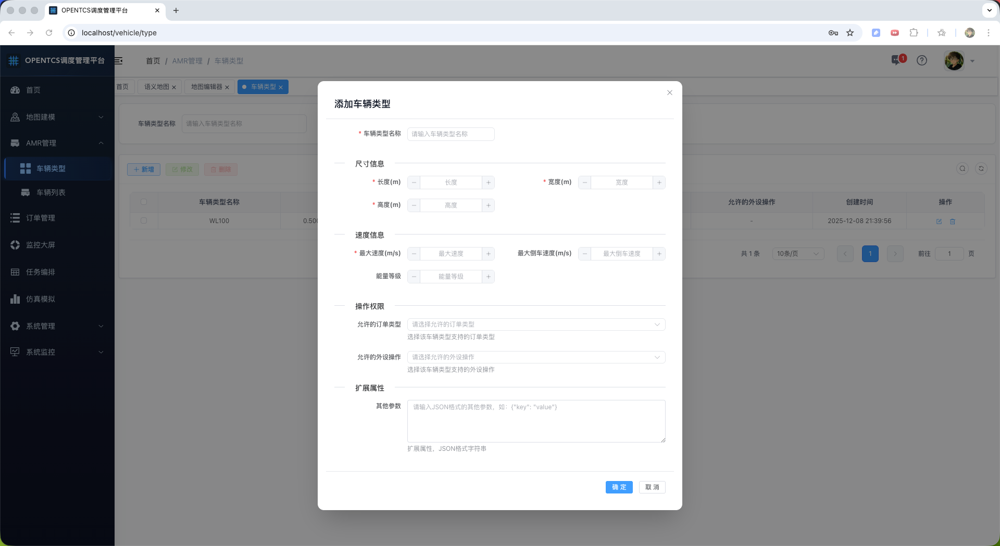

# 平台简介


OpenTCS Plus 是基于 OpenTCS 核心思想构建的企业级AGV调度系统，在保留 OpenTCS 稳定调度内核的同时，提供了更现代化的架构、更友好的用户界面和更强大的功能扩展。

## 项目架构
考虑仓储物流核心私有化部署的场景，实现单机模式调度系统，采用模块化划分，方便可扩展为微服务集群模式。

## 目录结构

### 项目根目录
```
opentcsplus/
├── opentcs-plus/            # 后端核心系统
├── opentcs-plus-web/        # 前端Web界面
├── opentcs-plus-docs/       # 项目文档
├── logs/                    # 日志文件
└── .trae/                   # 开发工具配置
```

### 后端系统结构
```
opentcs-plus/
├── opentcs-admin/                     # Web入口模块
│   ├── src/main/java/org/opentcs/web/ # Web控制器和服务
│   └── src/main/resources/            # 配置文件
├── opentcs-common/                    # 通用模块
│   ├── opentcs-common-core/           # 核心通用功能
│   ├── opentcs-common-mybatis/        # MyBatis集成
│   ├── opentcs-common-redis/          # Redis集成
│   ├── opentcs-common-security/       # 安全模块
│   └── opentcs-common-web/            # Web通用功能
├── opentcs-modules/                   # 业务模块（按照领域拆分）
│   ├── opentcs-module-algorithm/      # 路径规划和调度算法
│   ├── opentcs-module-driver/         # 车辆驱动和通信
│   ├── opentcs-module-map/            # 地图管理和编辑
│   ├── opentcs-module-monitor/        # 系统监控
│   ├── opentcs-module-order/          # 订单管理
│   ├── opentcs-module-simulation/     # 仿真模拟
│   ├── opentcs-module-system/         # 系统管理
│   └── opentcs-module-vehicle/        # 车辆管理
├── doc/                               # 项目文档
│   └── img/                           # 演示图片
└── pom.xml                            # Maven配置
```

### 前端系统结构
```
opentcs-plus-web/
├── src/                               # 源代码
│   ├── api/                           # API接口
│   ├── assets/                        # 静态资源
│   ├── components/                    # 组件
│   ├── layout/                        # 布局
│   ├── router/                        # 路由
│   ├── store/                         # 状态管理
│   ├── utils/                         # 工具类
│   ├── views/                         # 页面
│   ├── App.vue                        # 应用入口
│   └── main.ts                        # 主入口
├── public/                            # 公共资源
├── dist/                              # 构建输出
└── package.json                       # 项目配置
```

## 功能清单列表

| 模块名称 | 模块描述 | 主要功能 |
| :--- | :--- | :--- |
| **系统管理** | 系统基础配置和用户管理 | 用户管理、角色管理、权限管理、系统参数配置 |
| **地图管理** | 地图创建、编辑和管理 | 地图模型管理、地图编辑器、路径规划、站点管理 |
| **车辆管理** | AGV车辆的管理和监控 | 车辆列表管理、车辆状态监控、车辆类型配置 |
| **订单管理** | 任务订单的创建和管理 | 订单创建、订单状态跟踪、订单历史记录 |
| **算法模块** | 路径规划和调度算法 | 最短路径计算、车辆调度优化、任务分配策略 |
| **驱动模块** | 车辆通信和控制 | 车辆驱动适配、通信协议管理、车辆状态采集 |

## 在线体验

- **演示地址**: http://localhost:8088
- **默认账号**: admin
- **默认密码**: admin123

## 演示图

### 登录页面


### 首页


### 地图管理


### 地图编辑器


### 订单管理


### 车辆列表


### 车辆类型


---

## 最后
目前正在逐步迭代完善中，有什么问题、建议可以微信联系我 \
vx: SmFzb25FeHBsb3Jlcg== (需要base64解码)

