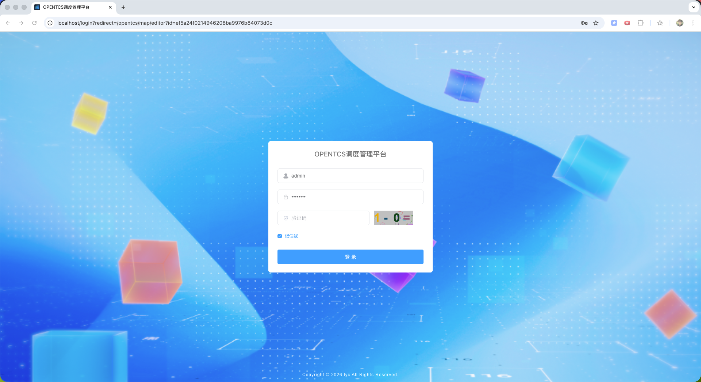
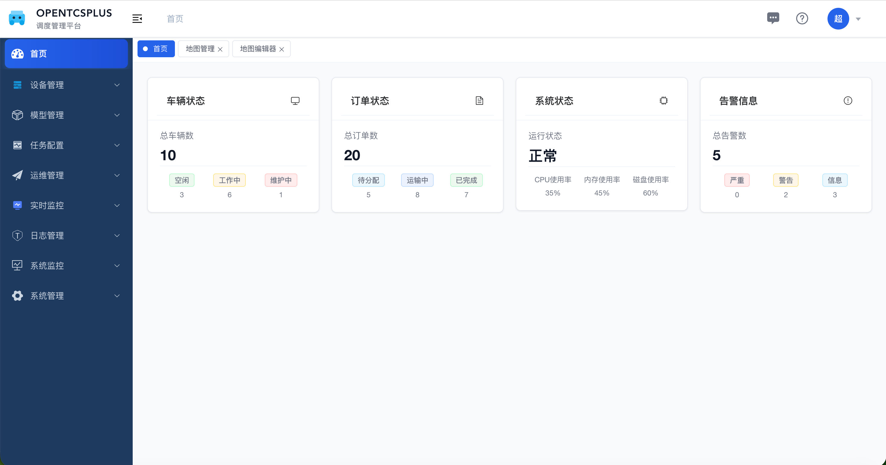
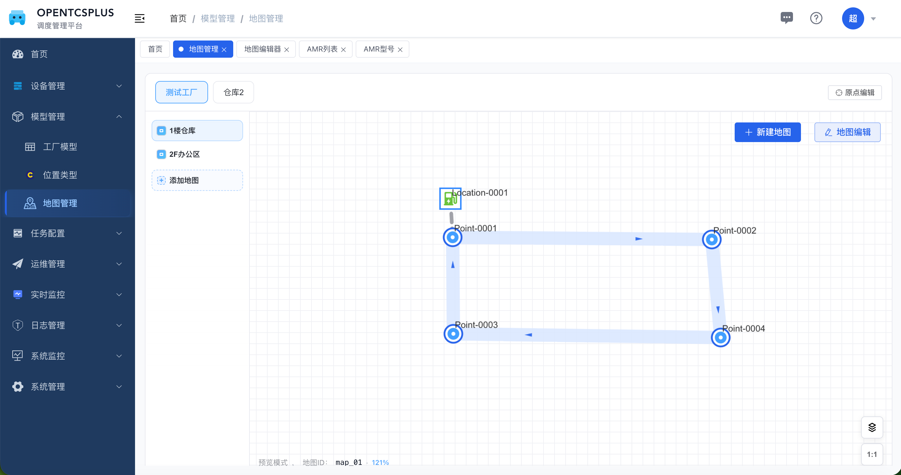
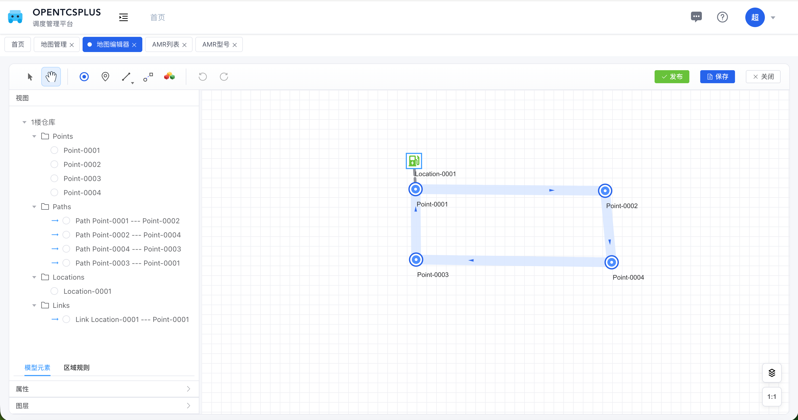
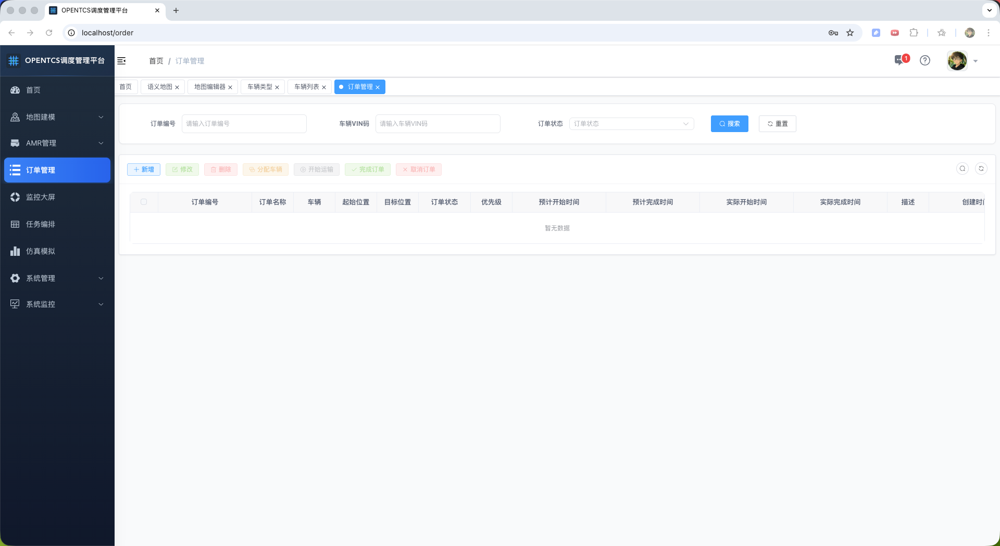
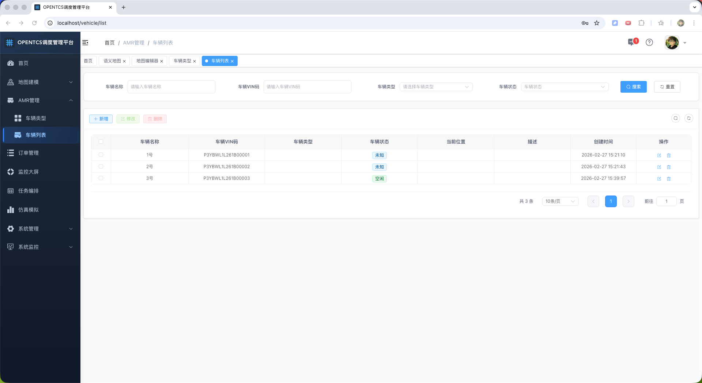
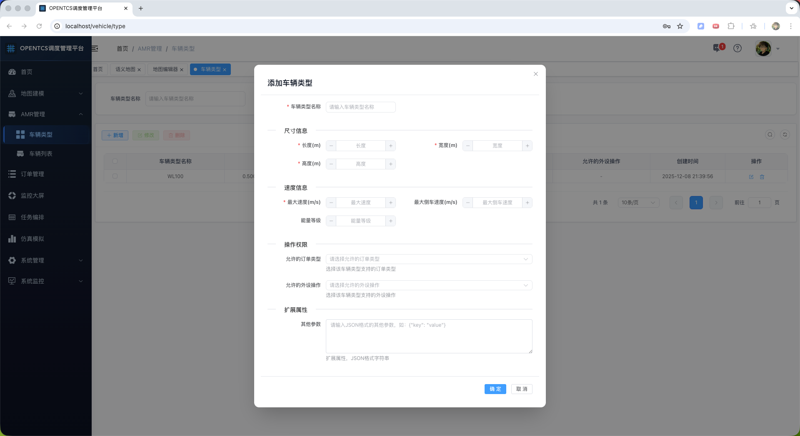

# 平台简介


OpenTCS Plus 是基于 OpenTCS 核心思想构建的企业级AGV调度系统，在保留 OpenTCS 稳定调度内核的同时，提供了更现代化的架构、更友好的用户界面和更强大的功能扩展。

## 项目架构
考虑仓储物流核心私有化部署的场景，实现单机模式调度系统，采用领域驱动模式，将核心领域模型、应用层、接口层、基础设施层进行分离，实现模块化、可扩展、可维护、可测试。


## 目录结构

### 项目根目录
```
opentcsplus/
├── opentcs-plus/            # 后端核心系统
├── opentcs-plus-web/        # 前端Web界面
├── opentcs-plus-docs/       # 项目文档
```

### 后端系统结构
```
opentcs-plus/
├── opentcs-admin/                          # 接口层 - Web 入口（Controller）
├── opentcs-applications/                   # 应用层 - 业务用例/服务编排
│   ├── opentcs-map-editor/                 # 地图编辑器
│   ├── opentcs-order/                      # 订单任务
│   ├── opentcs-vehicle/                    # 车辆管理
│   ├── opentcs-system/                     # 系统管理
│   └── opentcs-simulation/                 # 仿真模拟
├── opentcs-kernel/                         # 领域层 - OpenTCS Kernel 核心重构
│   ├── opentcs-kernel-api/                 # 核心接口定义
│   ├── opentcs-kernel-core/                # 核心领域模型
│   └── opentcs-kernel-persistence/         # 持久化
├── opentcs-driver/                         # 基础设施层 - AGV 驱动适配
│   ├── opentcs-driver-api/                 # 驱动接口
│   └── opentcs-driver-adapter-vda5050/     # VDA5050协议适配器
├── opentcs-common/                         # 通用模块
│   ├── opentcs-common-core/                # 核心：DTO、枚举、异常
│   ├── opentcs-common-mybatis/             # MyBatis Plus
│   ├── opentcs-common-redis/               # Redisson 缓存
│   ├── opentcs-common-security/            # 安全模块
│   ├── opentcs-common-satoken/             # Sa-Token JWT
│   ├── opentcs-common-websocket/           # WebSocket
│   ├── opentcs-common-mqtt/                # MQTT 集成
│   ├── opentcs-common-oss/                 # 文件存储
│   └── opentcs-common-sms/                 # 短信
├── opentcs-security/                       # 安全模块
└── pom.xml
```

### 前端系统结构
```
opentcs-plus-web/
├── src/                               # 源代码
│   ├── api/                           # API接口
│   ├── assets/                        # 静态资源
│   ├── components/                    # 组件
│   ├── layout/                        # 布局
│   ├── router/                        # 路由
│   ├── store/                         # 状态管理
│   ├── utils/                         # 工具类
│   ├── views/                         # 页面
│   ├── App.vue                        # 应用入口
│   └── main.ts                        # 主入口
├── public/                            # 公共资源
└── package.json                       # 项目配置
```
## 核心技术栈
### 后端
项目后端基于 [RuoYi-Vue-Plus](https://github.com/dromara/RuoYi-Vue-Plus) 构建。RuoYi-Vue-Plus 提供了完善的菜单权限管理功能，避免重复造轮子，使我们能够专注于业务逻辑的实现。系统管理模块保持了原有设计，但根据工业机器人实际落地场景（通常为私有化部署），移除了多租户功能。
调度核心采用**领域驱动设计（DDD）** 思想进行扩展，以应对复杂业务逻辑和模块划分的需求，确保系统的可维护性和可扩展性。

- 框架：Spring Boot 3.5.7, JDK 21
- 数据库：MyBatis Plus 3.5.14 + MySQL 8.0
- 缓存：Redisson 3.51.0 (Redis 7.0)
- 认证：Sa-Token 1.44.0 (JWT)
- 消息：MQTT, SSE
- 存储：MINIO
- AI 集成：Spring AI 1.0.0-M4（暂时还没有想好要如何做工业场景的AI Agent，后面的运维和算法模块肯定是要要基于llm大模型来构建闭环的场景，欢迎感兴趣的同学一起讨论）

### 前端技术栈
- 框架：Vue3 + TypeScript + Element Plus + Vue Router + Pinia + Axios + Vite

## 功能清单列表

| 模块名称 | 模块描述 | 主要功能 |
| :--- | :--- | :--- |
| **系统管理** | 系统基础配置和用户管理 | 用户管理、角色管理、权限管理、系统参数配置 |
| **地图管理** | 地图创建、编辑和管理 | 地图模型管理、地图编辑器、路径规划、站点管理 |
| **车辆管理** | AGV车辆的管理和监控 | 车辆列表管理、车辆状态监控、车辆类型配置 |
| **订单管理** | 任务订单的创建和管理 | 订单创建、订单状态跟踪、订单历史记录 |
| **算法模块** | 路径规划和调度算法 | 最短路径计算、车辆调度优化、任务分配策略 |
| **驱动模块** | 车辆通信和控制 | 车辆驱动适配、通信协议管理、车辆状态采集 |

## 在线体验

- **演示地址**: http://localhost:8088
- **默认账号**: admin
- **默认密码**: admin123

## 演示图

### 登录页面


### 首页


### 地图管理


### 地图编辑器


### 订单管理


### 车辆列表


### 车辆类型


---

## Git提交规范
参考 Angular 团队代码提交规范， 前后端可以通用
- **feat**：新增功能（如新接口、新业务逻辑）
- **fix**：修复 bug
- **style**：代码格式（不影响代码运行的变动，如空格、格式化、缺少分号等）
- **perf**：优化相关（如提升性能、体验）
- **refactor**：重构代码（既不是新增功能，也不是修复 bug 的代码变动）
- **revert**：回滚之前的提交
- **test**：测试相关（增加或修改测试用例）
- **docs**：文档更新（API 文档、注释）
- **chore**：构建过程或辅助工具的变动（如依赖更新、项目配置、脚本修改）
- **build**：影响构建系统或外部依赖的修改（如 webpack、gradle、npm 包）
- **ci**：持续集成配置（如 GitHub Actions、Jenkins、Travis）

## 最后
目前正在逐步迭代完善中，有什么问题、建议可以微信联系我 \
vx: SmFzb25FeHBsb3Jlcg== (需要base64解码)

